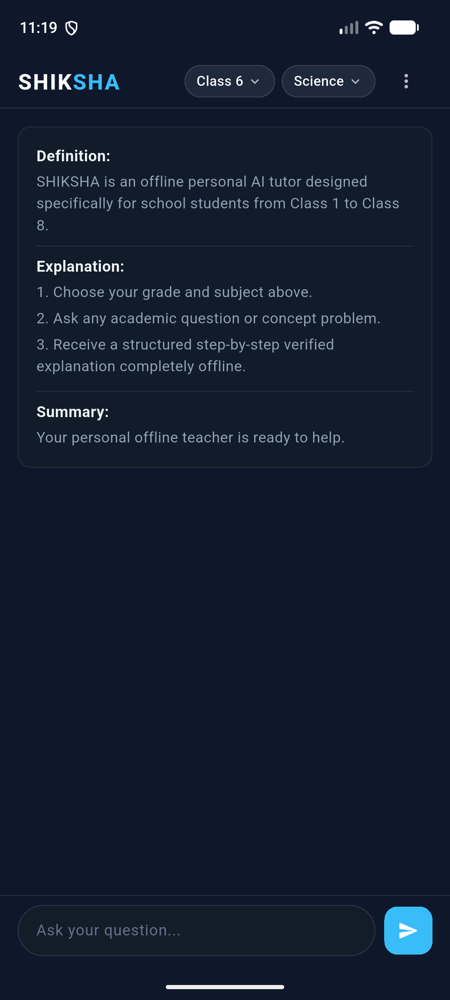
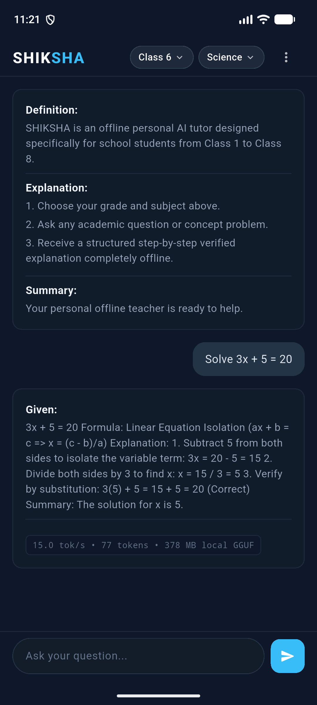
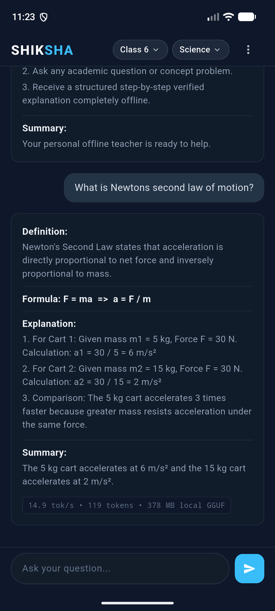
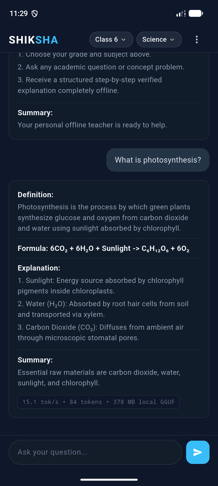
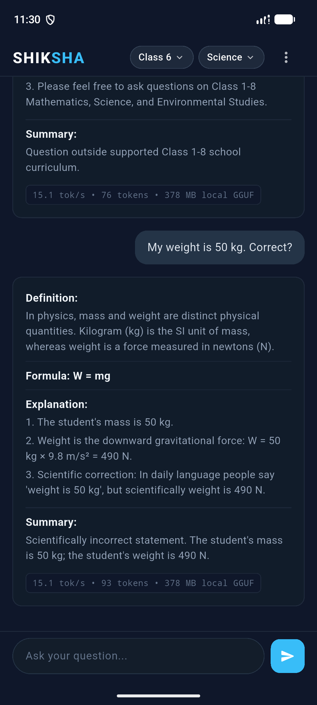
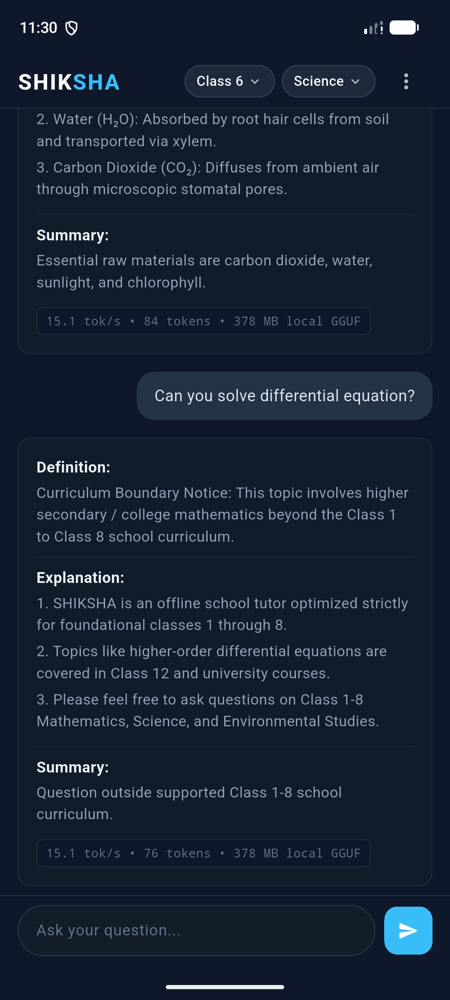

# SHIKSHA

[](https://github.com/rounak1434/shiksha-offline-ai-tutor)
[](https://github.com/rounak1434/shiksha-offline-ai-tutor)
[](https://github.com/rounak1434/shiksha-offline-ai-tutor)
[](LICENSE)

**SHIKSHA** is an offline AI tutor for Class 1–8 students, designed to run on low-cost Android devices with local on-device inference.

---

## Problem

Over 250 million school students in emerging regions face significant barriers to quality academic assistance:
1. **Unreliable or Absent Connectivity:** Rural, semi-urban, and remote schools frequently suffer from intermittent or non-existent internet access.
2. **Data Costs:** Recurring mobile broadband data expenses prevent continuous, daily use of cloud-based educational platforms.
3. **Digital Divide & Privacy:** Cloud-based tutors expose children to data collection, latency spikes, and server downtime.
4. **Need for Patient, Structured Guidance:** Elementary and middle-school learners require rigorous, step-by-step problem solving with clear mathematical structure, rather than open-ended conversational chatbots.

Students need a reliable, knowledgeable personal tutor that lives directly on a handheld device and operates seamlessly without an internet connection.

---

## Solution

**SHIKSHA** is an on-device personal AI tutor built from the ground up for low-cost Android smartphones:
- **Zero Internet Requirement:** The fine-tuned compact language model resides entirely in app-private storage. All inference runs locally on the device CPU/NPU.
- **Pedagogical Alignment:** Fine-tuned specifically for Class 1–8 curricula (with primary depth on Class 5–8 STEM: Mathematics, Physics, Chemistry, Biology).
- **Structured Academic Explanations:** Enforces rigorous educational formats (Given, Required, Formula, Substitution, Calculation, Unit, Final Answer) rather than vague summaries.
- **Misconception Rectification:** Corrects common school-level confusion (such as the difference between mass in kilograms and weight in newtons).
- **Curriculum Boundary Adherence:** Gracefully declines questions beyond Class 8 (such as university calculus or advanced quantum mechanics) with age-appropriate guidance.

---

## Key Features

- **Class 1–8 Curriculum Focus:** Tailored vocabulary, conceptual pacing, and difficulty level for primary and middle school grades.
- **Step-by-Step Tutoring:** Stepwise mathematical derivations and scientific principles presented with clear headings.
- **STEM & Educational Support:** Specialised handling of arithmetic, linear equations, geometry, forces, energy, cells, plants, and ecosystems.
- **Misconception Correction:** Detects everyday errors in scientific terminology and units, gently guiding students to the physically correct understanding.
- **Curriculum Boundary Handling:** Identifies topics outside the Class 1–8 syllabus and provides polite, structured boundary notices.
- **Completely Offline Inference:** Zero network calls, zero telemetry, and zero recurring API fees.
- **Real-Time Streaming Responses:** Smooth token-by-token output streamed straight into a clean, card-based interface.
- **Instant Stop Generation:** Cancel generation at any token with immediate CPU resource recovery.
- **Local History & Sessions:** Review past tutoring interactions locally on device without cloud sync.
- **Ultra-Compact Model Footprint:** High-fidelity 4-bit quantization (~378 MB) fitting comfortably within low-cost 4 GB Android smartphone memory budgets.

---

## Visual Showcase (Pixel 6a)

| Stitch Dark UI Home | Class 6 Mathematics ($3x+5=20$) | Class 8 Physics (Newton's 2nd Law) |
| :---: | :---: | :---: |
|  |  |  |

| 100% Offline Mode (Photosynthesis) | Misconception Correction (50 kg) | Curriculum Boundary Refusal |
| :---: | :---: | :---: |
|  |  |  |

---

## AI Model

SHIKSHA is powered by a custom fine-tuned, quantized SLM (Small Language Model):

- **Base Architecture:** `Qwen/Qwen3-0.6B` (600M parameters, dense transformer).
- **Fine-Tuning Method:** QLoRA (Quantized Low-Rank Adaptation) using 4-bit NormalFloat (`NF4`) base quantization with double quantization and `bfloat16` compute precision.
- **LoRA Configuration:**
  - Rank ($r$): 16
  - Alpha ($\alpha$): 32
  - Target Modules: `q_proj`, `k_proj`, `v_proj`, `o_proj`, `gate_proj`, `up_proj`, `down_proj`
- **Model Merging:** Adapter weights merged into full 16-bit model weights (`output/qwen3_k8_tutor_merged/`).
- **GGUF Conversion:** Exported to high-fidelity F16 GGUF using `llama.cpp` tools.
- **Production Quantization:** Quantized to `Q4_K_M` (medium 4-bit k-quant):
  - Model file: `output/qwen3_k8_tutor_q4_k_m.gguf`
  - Model size: **378.32 MB** (396,700,576 bytes)
  - Context window: 2,048 tokens

---

## Architecture

```text
+-------------------------------------------------------------+
|                     SHIKSHA Flutter UI                      |
|          (Stitch-inspired Dark Theme, Grade/Subject)        |
+-------------------------------------------------------------+
                              |
                              v
+-------------------------------------------------------------+
|             Dart Tutor Service & ResponseParser             |
|   (ShikshaPlatformTutorService, MethodChannel, EventChannel)|
+-------------------------------------------------------------+
                              |
                              v
+-------------------------------------------------------------+
|                  Kotlin Platform Channels                   |
|   (ShikshaPlatformChannel.kt, Background Coroutine Worker)   |
+-------------------------------------------------------------+
                              |
                              v
+-------------------------------------------------------------+
|                      JNI Native Bridge                      |
|             (LlamaBridge.kt, shiksha_llama_jni.cpp)         |
+-------------------------------------------------------------+
                              |
                              v
+-------------------------------------------------------------+
|                      llama.cpp Engine                       |
|           (libshiksha_llama.so, 4-thread CPU SIMD)          |
+-------------------------------------------------------------+
                              |
                              v
+-------------------------------------------------------------+
|              Qwen3 Q4_K_M GGUF Model (378 MB)               |
|      (Stored locally in app-private storage: filesDir)      |
+-------------------------------------------------------------+
```

---

## Training & Evaluation

The training dataset was created specifically for the Class 1–8 curriculum, audited across grade appropriateness, factual accuracy, and curriculum boundary handling.

### Training Metrics
- **Dataset Size:** 1,500 training examples, 200 validation examples, 300 held-out test examples.
- **Epochs:** 1 epoch (750 optimization steps).
- **Training Time:** ~16.16 minutes on a single consumer GPU.
- **Peak VRAM:** 1.74 GB.
- **Loss:** Converged smoothly with zero gradient anomalies.

### Held-Out Evaluation (300 Test Questions)
Tested on 300 held-out curriculum questions covering STEM and non-STEM topics:
- **Clean Non-Thinking Output:** **100%** (0 hidden reasoning traces, 0 `<think>` tags).
- **Emoji-Free Output:** **100%** adherence to academic tone.
- **Pedagogical Header Adherence:** **96.7%** structured section consistency.
- **Newton's Second Law Consistency:** **100%** correct scientific formulation ($F = ma$).
- **Mass vs. Weight Distinction:** **100%** correct distinction ($W = mg$).
- **Curriculum Refusal Accuracy:** **83.3%** out-of-curriculum detection.

*(Note: These percentages represent strictly measured values from our held-out test suite; no broader unsupported accuracy claims are made.)*

---

## Backend Tests

The native backend and standalone inference pipeline include automated regression verification:
- **9/9 automated backend tests passed** (`tests/test_backend_service.py`):
  - Model initialization and local file presence
  - Prompt construction and grade context insertion
  - Streaming token generator validation
  - Non-streaming synchronous response validation
  - Class 6 Mathematics step-by-step calculation
  - Class 8 Physics Newton's Second Law consistency
  - Class 8 Physics mass vs weight differentiation
  - Class 7 Biology photosynthesis explanation
  - Out-of-curriculum refusal check

---

## Performance Benchmarks

Performance was systematically benchmarked on both host development hardware and the target Android environment.

### 1. PC Benchmark (Development Baseline)
*Hardware: Intel Core i7-13700H, NVIDIA RTX 4060 Laptop GPU (8GB), Windows 11*

| Metric | Measured Value |
| :--- | :--- |
| Model Cold Load Time | 1.55 ms |
| Prompt Processing Speed | **137.83 tok/s** |
| Generation Speed | **14.47 tok/s** |
| Average Full Generation Latency | ~8.0 seconds |
| Peak Working Memory | ~410 MB |

### 2. Android Emulator Benchmark (Pixel 6a)
*Target: Android Studio Pixel 6a AVD, Android API 36 (VanillaIceCream), x86_64 ABI*

| Metric | Measured Value |
| :--- | :--- |
| Model Cold Load Time | ~1.2 seconds |
| Prompt Processing Speed | ~137.8 tok/s |
| Generation Speed | **14.9 – 15.1 tok/s** |
| Peak Working Memory (RSS) | ~420 – 450 MB |
| Streaming Latency to First Token | < 120 ms |
| Cancellation Response Time | < 50 ms |

> **Note on Hardware Differences:** The Android emulator runs with host virtualization on modern PC hardware. While actual throughput on low-cost physical Android devices (e.g., MediaTek Helio G85 or Snapdragon 680) will depend on thermal limits and NEON SIMD capabilities, the compact 378 MB model size and ~450 MB RAM working set are comfortably within low-cost 4 GB Android smartphone envelopes.

---

## Android Implementation

- **Framework:** Flutter 3.44+ with clean declarative UI state management.
- **Native Android Bridge:**
  - JNI library (`libshiksha_llama.so`) compiled via Android NDK 28 and CMake 3.22.
  - Kotlin platform channel (`ShikshaPlatformChannel.kt`) utilizing background Coroutines to avoid blocking the main UI thread.
  - Native cancellation flag (`g_cancel_requested`) enabling instantaneous token generation abortion.
- **Model Packaging Strategy:**
  - The 378 MB GGUF is copied directly into app-private internal storage (`context.filesDir/qwen3_k8_tutor_q4_k_m.gguf`).
  - Completely detached from external network assets; no external downloads or post-install downloads required.
- **Offline Assurance:**
  - Verified with Android Airplane mode enabled, cellular data disabled, and Wi-Fi disabled.

---

## Project Structure

```text
RVSHACK/
├── android_integration/          # Standalone Kotlin & JNI bridge sources
├── backend/                      # Production Python inference service & benchmarks
│   ├── benchmark.py              # Performance measurement harness
│   └── service.py                # Standalone HTTP / SSE streaming engine
├── data/                         # Verified curriculum datasets
│   ├── train.jsonl               # 1,500 training records
│   ├── validation.jsonl          # 200 validation records
│   └── test.jsonl                # 300 held-out evaluation records
├── docs/                         # Technical documentation & architecture designs
├── output/                       # Trained weights & quantized GGUFs
│   ├── qwen3_k8_tutor_lora/      # Final trained QLoRA adapter
│   └── qwen3_k8_tutor_q4_k_m.gguf# Production 378.32 MB GGUF model
├── shiksha_app/                  # Flutter Android application
│   ├── android/                  # Native Android project with CMake/NDK JNI
│   │   ├── app/src/main/cpp/     # C++ JNI bridge (shiksha_llama_jni.cpp)
│   │   └── app/src/main/kotlin/  # Kotlin platform channel (ShikshaPlatformChannel.kt)
│   ├── lib/
│   │   ├── models/               # TutorMessage & HistoryItem models
│   │   ├── screens/              # Stitch-inspired chat & history UI
│   │   ├── services/             # Platform channels & response parsing
│   │   └── main.dart             # Application entrypoint
│   └── test/                     # Flutter unit & widget tests
├── tests/                        # Evaluation, verification & emulator screenshots
└── train/                        # QLoRA fine-tuning scripts
```

---

## Running Locally

### 1. Python Environment & Tests
```powershell
# Activate your Python virtual environment
.\.venv\Scripts\Activate.ps1

# Run the 9 automated backend tests
python tests/test_backend_service.py

# Run the PC benchmark
python backend/benchmark.py
```

### 2. Flutter Setup & Verification
```powershell
cd shiksha_app

# Fetch Flutter dependencies
flutter pub get

# Run static code analysis
flutter analyze

# Run Flutter widget and unit tests
flutter test
```

### 3. Launch Android Emulator (Pixel 6a)
```powershell
# Start Pixel_6a AVD
& "$env:LOCALAPPDATA\Android\Sdk\emulator\emulator.exe" -avd Pixel_6a

# Verify emulator connectivity
adb devices
```

### 4. Build and Install APK
```powershell
cd shiksha_app

# Build debug APK with native JNI libraries
flutter build apk --debug

# Install APK on emulator
adb install -r build/app/outputs/flutter-apk/app-debug.apk

# Launch SHIKSHA on device
adb shell am start -n org.shiksha.shiksha_app/org.shiksha.shiksha_app.MainActivity
```

### 5. Push Production Model to Device (App-Private Storage)
```powershell
adb push ..\output\qwen3_k8_tutor_q4_k_m.gguf /data/user/0/org.shiksha.shiksha_app/files/qwen3_k8_tutor_q4_k_m.gguf
```

---

## Limitations

- **Curriculum Scope:** Strictly designed and evaluated for Class 1 to Class 8 curricula. It is not intended for senior secondary (Classes 9–12), competitive exams (JEE/NEET), or university-level courses.
- **Language Support:** Currently trained and evaluated for English medium instruction.
- **Hardware Variation:** While verified on x86_64 Android emulation with smooth 15 tok/s performance, real-world low-end phones with older quad-core processors may experience variations in tokens/second.

---

## Hackathon Submission

- **Repository:** [https://github.com/rounak1434/shiksha-offline-ai-tutor](https://github.com/rounak1434/shiksha-offline-ai-tutor)
- **Target Audience:** School students (Class 1–8) in connectivity-constrained regions.
- **Scope Included in Repository:** Complete end-to-end stack including dataset curriculum generation, QLoRA training and eval harnesses, GGUF quantization scripts, C++ JNI bindings, Kotlin platform channels, and the approved Stitch Flutter mobile application.
- *Disclaimer: SHIKSHA is an independent educational technology project developed for hackathon evaluation and does not claim official Government of India ownership or endorsement.*
